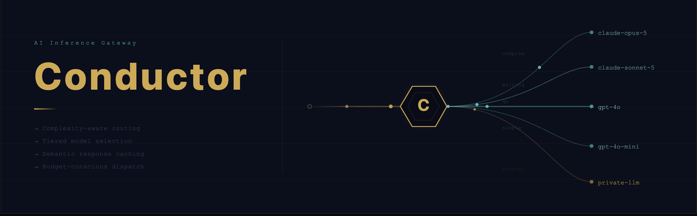

# Conductor



An AI inference gateway that reduces LLM costs through tiered routing, exact and semantic response caching, and agent-traffic compression — without requiring callers to change their code.

Conductor speaks the OpenAI wire protocol. Point any SDK at it with a `base_url` change and it works immediately.

---

## Features

- **Complexity routing** — scores each request across length, turn count, keyword presence, and structural cues; routes simple requests to a cheap model and complex ones to a capable model
- **Exact cache** — identical requests (after trimming and routing) are never sent to a provider twice
- **Semantic cache** — similar requests are matched via cosine similarity on TF-weighted vectors, backed by an HNSW approximate nearest-neighbour index
- **Context trimming** — sliding window keeps conversations within a token budget; dropped turns are optionally summarised by a small model and injected back as context
- **Output control** — per-route `max_tokens` cap, `response_format` enforcement, and concise-response instruction injection
- **Agent compression** — shorthand codec compresses verbose LLM preamble in agent-to-agent traffic; history shrinks across turns without losing meaning
- **Live route management** — `PATCH /admin/routes/default` updates routing and output config instantly, no restart needed
- **Per-caller telemetry** — tracks requests, tokens, cache outcomes, and model tier splits per API key

---

## Quick Start

```sh
# Build
go build -o conductor ./cmd/gateway

# Run in dev mode (no auth, no provider — useful for testing the pipeline)
mkdir -p data
./conductor

# Run with OpenAI
OPENAI_API_KEY=sk-... ./conductor

# Run with both providers and auth
OPENAI_API_KEY=sk-... \
ANTHROPIC_API_KEY=sk-ant-... \
GATEWAY_API_KEYS="sk-gw-mykey:myapp" \
ADMIN_API_KEY=sk-admin-secret \
./conductor
```

The server starts on `:8080` by default.

---

## Making a Request

```sh
curl http://localhost:8080/v1/chat/completions \
  -H "Content-Type: application/json" \
  -d '{
    "model": "gpt-4o-mini",
    "messages": [{"role": "user", "content": "What is 2 + 2?"}]
  }'
```

Or use the OpenAI SDK with `base_url="http://localhost:8080/v1"` — no other changes needed.

Response headers indicate cache outcome:

| Header | Meaning |
|---|---|
| `X-Cache: HIT` | Served from exact cache |
| `X-Cache: SEMANTIC-HIT;score=0.87` | Served from semantic cache |
| _(absent)_ | Cache miss; provider was called |

---

## Configuration

The minimal useful configuration is one API key. Everything else has a default.

| Variable | Default | Purpose |
|---|---|---|
| `OPENAI_API_KEY` | — | OpenAI provider |
| `ANTHROPIC_API_KEY` | — | Anthropic provider |
| `HOSTED_LLMS` | — | JSON array of private OpenAI-compatible endpoints |
| `GATEWAY_API_KEYS` | — | `key:caller_id` pairs for auth; empty = dev mode |
| `ADMIN_API_KEY` | — | Protects `/admin/*` endpoints |
| `GATEWAY_ADDR` | `:8080` | Listen address |
| `DEFAULT_MODEL` | `gpt-4o-mini` | Model when caller omits one |
| `CACHE_PATH` | `data/cache.gob` | Persistence path for in-memory cache |
| `ROUTES_CONFIG` | `config/routes.json` | Route and model configuration |

Route configuration (model tiers, token budget, thresholds) lives in `config/routes.json` and can be updated at runtime via the admin API without restarting.

Private hosted LLMs are registered via `HOSTED_LLMS` as a JSON array:
```sh
export HOSTED_LLMS='[{"name":"my-private-llm","url":"https://api.example.com/v1","key":"sk-..."}]'
```
The `name` is used as the model identifier in `routes.json`.

---

## Admin API

```sh
# Telemetry
curl http://localhost:8080/admin/stats \
  -H "Authorization: Bearer sk-admin-secret"

# Cache stats
curl http://localhost:8080/admin/cache/stats \
  -H "Authorization: Bearer sk-admin-secret"

# Update route config live
curl -X PATCH http://localhost:8080/admin/routes/default \
  -H "Authorization: Bearer sk-admin-secret" \
  -H "Content-Type: application/json" \
  -d '{"complexity_threshold": 0.5}'
```

---

## Tests and Benchmarks

```sh
# All tests
go test ./...

# With race detector
go test -race ./...

# Benchmarks
go test ./internal/gateway/... -bench=BenchmarkHandler_CacheHit -benchmem
go test ./internal/vec/...     -bench=BenchmarkHNSW             -benchmem
```

---

## Documentation

| Document | Contents |
|---|---|
| [Architecture](docs/architecture.md) | Request pipeline, component descriptions, package graph, interface seams |
| [Design](docs/design.md) | Problem statement, design decisions and their rationale, trade-offs |
| [Coding Standards](docs/coding-standards.md) | Conventions, error handling, concurrency, testing, naming |
| [Implementation](docs/implementation.md) | Full env var reference, `routes.json` schema, per-package API |
| [How To Run](docs/how-to-run.md) | Build, run, curl examples, admin API, tests, benchmarks |

---

## Zero External Dependencies

Conductor uses only the Go standard library through Phase 6. The Redis client is hand-written RESP2 over `net.Conn`; the HNSW index is implemented from scratch; serialisation uses `encoding/json` and `encoding/gob`. The `go.mod` has no `require` entries.
